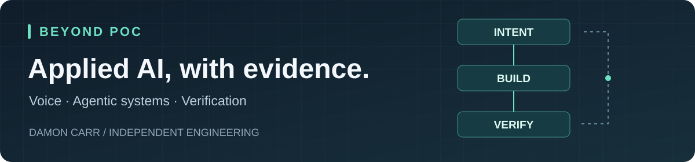

## Damon Carr

  

### 🚀 [Beyond POC](https://beyondpoc.com) — *Beyond the prototype. Into the real world.*

> AI becomes useful when the whole system works.

**[beyondpoc.com](https://beyondpoc.com)** is my independent showcase of applied AI: working systems, bounded experiments, and the evidence that separates them.

- **Workflow orchestration** with durable state, so long-running AI work survives failures
- **Quality gates** that check AI output before anything ships
- **Agent-coordinated architecture** — research → create → review → publish → observe
- **Observability and cost accountability**, so you can see what the system did and what it cost
- **AI-assisted engineering** — intent, critique, verification, documentation

Featured builds: [Autonomous Commerce Engine](https://beyondpoc.com/solutions/autonomous-commerce) and [Smith Phone](https://beyondpoc.com/solutions/smith-phone).

📄 **Publication:** [*Autonomous Commerce Engine: Steering an Agentic eCommerce Pipeline from Market Signal to Verified Release*](https://doi.org/10.5281/zenodo.22996451) — technical report, Zenodo, 2026. DOI [10.5281/zenodo.22996451](https://doi.org/10.5281/zenodo.22996451)

### Recent engineering work

**[Smith Phone](https://beyondpoc.com/solutions/smith-phone) — conversational AI with explicit authority**

A custom phone integration using **OpenAI GPT-Live-1** (`gpt-live-1`) for live voice, with **GPT-6 Luna** (`gpt-6-luna`) configured for backend reasoning, a Twilio phone bridge, and scoped MCP tools. OpenAI describes GPT-Live as full-duplex voice: it can listen and speak at the same time, with deeper work delegated to a backend model. [OpenAI GPT-Live documentation](https://developers.openai.com/api/docs/guides/live). I’m working on the boundary between live conversation, backend context, and action: a read-only lookup can inform an answer, while a task proposal must be reviewed and separately authorized before execution. A spoken request or an incoming event is not permission.

The engineering challenges include scoped authorization, duplicate delivery, uncertain provider outcomes, and useful diagnostics without retaining recordings or transcripts. The public case study records a successful audio exchange and automated verification, while keeping the full live proposal → review → confirmation → execution journey explicitly unverified. **In development.**

**Legacy VB.NET + Product AI — incremental modernization**

A private POC adding a product assistant to an existing VB.NET Windows Forms application. This work brings conversational AI into an established desktop workflow while keeping the scope bounded and checking existing behavior. **A POC, with further validation needed before wider use.**

### How I verify the work

- **Characterize before changing:** establish meaningful behavior and boundary cases, then use a failing regression to demonstrate an approved repair.
- **Test at the right layer:** fast unit checks for local rules, integration checks for real boundaries, and end-to-end evidence for user journeys.
- **Make evidence reviewable:** keep the tested scope, source revision, results, and remaining gaps with the change. Coverage and passing checks each answer a limited question.
- **Keep release gates honest:** a configured check is not an observed pass; a passing test is not deployment approval. Independent review and explicit acceptance still matter.

📬 [hello@beyondpoc.com](mailto:hello@beyondpoc.com)

> 🔒 **Most of my work lives in private repositories.** Access is available on request — email [hello@beyondpoc.com](mailto:hello@beyondpoc.com).

---

**AI I build with every day:** OpenAI **GPT-6 Astra** · Anthropic **Claude Code** with **Opus 5.5**

Side experiment in AI-assisted engineering: a Blender film + Godot web game, built and deployed end to end with Claude Code in a day — [blenderplayground](https://github.com/Wilder-Damon/blenderplayground).
